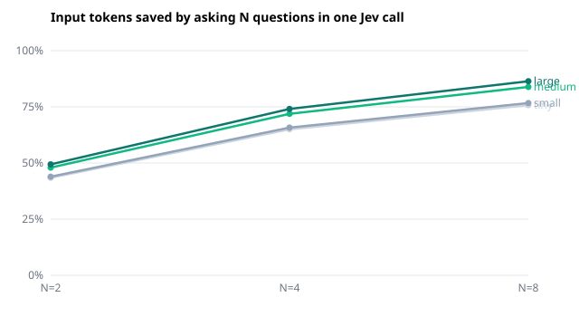

# jev-fanout-bench

A reproducible measurement of one claim about [Jev](https://docs.typesafe.ai/),
TypeSafe AI's System One decision model:

> Jev ingests the `state` once and evaluates every question against it in
> parallel. — [TypeSafe, *Models*](https://docs.typesafe.ai/models)

If that holds on the bill, asking N questions in **one** request should cost
the state once, and asking them in **N** requests should cost it N times.
TypeSafe's own [parallel-questions cookbook](https://docs.typesafe.ai/cookbooks/parallel_questions)
measured this once, on one document, as 12.2x cheaper. This repository
measures it across state sizes and question counts, and checks three things
the cookbook does not:

1. **Is billing exactly linear?** Under a linear model,
   `separate − batched = (N − 1) × F`, where F is everything one request bills
   apart from its questions: the state plus a fixed per-request overhead. The
   report derives F independently at every N and question subset and shows
   how far the estimates for one state disagree. A one-word `tiny` state is
   included as a control, so the fixed overhead can be read off on its own.
2. **How big is the saving, by state size?** Roughly 25, 680 and 3,000-token
   states (a bare ticket; a ticket with account history; a ticket with long
   history and order records), at N = 2, 4 and 8 questions, in percent and in
   dollars per thousand items.
3. **Do the answers change?** Every question is asked both inside the batch
   and alone, and every request is repeated, so the batched-vs-single
   difference is reported next to the difference between two identical
   requests. A shift smaller than that noise floor is not an effect of
   batching.

## Results (2026-09-23)

2,976 requests to `jev-1.13-20260917` through OpenRouter's TypeSafe-compatible
System One endpoint (provider: TypeSafe). $0.156 billed in total. Full report:
[`results/summary.md`](results/summary.md); every request and response:
[`results/raw.jsonl`](results/raw.jsonl) (checksums in `results/SHA256SUMS`).



- **The bill is exactly tokens × rate.** Across all 2,976 responses,
  `usage.cost` differs from `input_tokens × $0.042/1M` by $0.000000000. The
  122,844 output tokens returned were not charged.
- **Billing is exactly linear.** For every state, the implied per-request
  cost F is identical — 0 tokens of spread — whether derived at N = 2, 4 or 8
  and whichever questions were asked.
- **Every request carries about 261 input tokens of fixed overhead.** A
  one-word state bills F = 261. TypeSafe's own API examples agree: a
  one-sentence state with one Noul question reports `input_tokens` of 296
  ([API reference](https://docs.typesafe.ai/api)). A calculator that bills
  only state + questions understates small requests badly.
- **So batching saves more than the state alone would suggest**, even for
  tiny states. Median input tokens, batched vs one call per question:

  | State (≈tokens) | N = 2 | N = 4 | N = 8 |
  |---|---:|---:|---:|
  | tiny (control) | 43% | 65% | 76% |
  | small (~25) | 44% | 66% | 77% |
  | medium (~680) | 48% | 72% | 84% |
  | large (~3,000) | 49% | 74% | 86% |

- **Answers do not change.** Batched-vs-single differences equal the noise
  floor of sending the identical request twice: Noul 0.005 mean (0.005
  repeated), Score 0.010 (0.010), Choice top option never differed.
- **Latency:** eight questions in one call returned 7.7–8.6× faster than eight
  calls made one after another (medians; serial, not concurrent).

## Round 2 (2026-09-23): what a request is billed, limits, wording

487 more requests (`bench2.py`, results in [`results/round2/`](results/round2/summary.md)).
Answers from this round are used only to compute the differences below and are
not published: TypeSafe's customer agreement forbids using outputs to build or
train competing models.

- **Billing formula.** ~260 tokens per request, plus per question ~10 tokens
  of framing, ~1 per English instruction word, ~8 per Choice option (~21 with
  a six-word description) and 8 per Score level — all linear, R² ≥ 0.999.
- **Characters per token:** English 4.92, Spanish 4.44, Russian 1.78, Hindi
  1.72, Arabic 1.49, Korean 1.44, Japanese 1.01, Chinese 1.00; JSON state ~2.35.
- **Context limits** (bisection): state + longest question ≤ 32,768 content
  tokens, state + all questions ≤ 65,536; the overhead counts toward neither.
  No question-count cap — 1,000 questions in one call succeeded.
- **No interference.** 16, 60 or 120 unrelated questions in the same call moved
  four target answers no more than repeating them; median latency 426 ms at 4
  questions, 436 ms at 124.
- **Languages.** Translating the ticket moved answers 3–6× the English repeat
  noise; translating the questions too moved them further in all seven
  languages and cost 9–48% more tokens. Keep questions in English.
- **Wording.** Reordering Choice options never changed the top option;
  removing option descriptions or paraphrasing moved probabilities by 2–10
  points — re-check thresholds after rewording.
- A 72-hour latency monitor (`monitor.py`, every 5 minutes) is running;
  samples accumulate in `results/round2/latency.jsonl`.

An estimator built on these coefficients (median error 0.8% on 24 measured
requests) is at [jevpricing.com/tokens](https://jevpricing.com/tokens/).

## Run it

Python 3.10+, standard library only.

```bash
export TYPESAFE_API_KEY=...        # from https://console.typesafe.ai/ (new signups paused since 2026-09-22)
python bench.py run                # ~2,980 requests, ~15 minutes
python bench.py report             # -> results/summary.md, summary.json, fanout.svg
```

A full run sends 2,976 requests and about 2 million input tokens: roughly
**$0.09** at the published $0.042 per million input tokens (output is not
billed). It pins `jev-1.13.0` rather than `jev-latest`, which can move to a
new model mid-study; `--model` overrides it. 429 and 529 responses and
network errors are retried with backoff, as the API docs ask.

TypeSafe paused new signups on 22 September 2026. Without a TypeSafe
account, run the identical requests through OpenRouter's TypeSafe-compatible
System One endpoint with an OpenRouter key:

```bash
export OPENROUTER_API_KEY=...
python bench.py run --provider openrouter    # model typesafe/jev-1.13
```

Cloudflare Workers AI serves the same model (`typesafe/jev`, $0.042 per 1M
input in the Cloudflare dashboard) to any Cloudflare account, with a Workers
AI API token:

```bash
export CLOUDFLARE_API_TOKEN=... CLOUDFLARE_ACCOUNT_ID=...
python bench.py run --provider cloudflare --max-blocks 2   # smoke test first
python bench.py run --provider cloudflare
```

Workers AI forwards to `jev-latest` and cannot pin a version; the report
refuses a run whose responses name more than one model.

OpenRouter also returns what each request was charged (`usage.cost`), and the
report checks that against input tokens × the published rate. Keys can
instead live in `~/.config/<provider>/api_key`; they are sent only in the
Authorization header and never written to the log.

To exercise the whole pipeline without a key or network access:

```bash
python bench.py run --dry-run --out /tmp/dry/raw.jsonl
python bench.py report --input /tmp/dry/raw.jsonl
```

Dry-run numbers are a characters-divided-by-four estimate, are labelled
`DRY RUN` everywhere they appear, and are never a result.

## What is measured, exactly

- **Inputs** (`bench_data.py`): 8 synthetic support tickets, written for this
  repository, at 3 state sizes plus the `tiny` control. Eight questions — four
  Noul, two Choice, two Score — split for each N into 8/N disjoint subsets, so
  every question is asked equally often at every N and N is not confounded
  with which questions were asked.
- **Blocks**: one block is a (ticket, size, N, subset, repeat). Its batched
  call and its N single calls run back to back, batched-first or
  singles-first at random, so both arms see the same moment of API load.
  Blocks run in a seeded random order; every block is repeated 3 times.
- **Tokens**: `usage.input_tokens` as returned by the API. Nothing is
  estimated in a real run.
- **Latency**: per request over one persistent, pre-warmed HTTPS connection,
  excluding retries (which are logged and dropped from the latency figures).
  The N single calls of a block are summed as a serial sequence — how an
  application asking one question at a time experiences them.
- **Answers**: Noul and Score on a 0–1 scale; for Choice, how often the top
  option differs and the total-variation distance between the probability
  distributions. This is stability, not accuracy: the tickets are unlabelled.
- **Raw data**: every request body (and its SHA-256), status, timings and full
  response, plus a run header with the Python version, platform, git commit
  and the price used, are appended to `results/raw.jsonl` before anything is
  summarised. `report` refuses runs with failed or duplicated requests or
  mixed model versions unless told otherwise.

## Limitations

One client, one network location, one region. Serial timing of the separate
calls overstates the latency gap an application that fans out concurrently
would see. The tickets are synthetic and in English, the language TypeSafe
says Jev is most accurate in.

## Related

- [jevpricing.com](https://jevpricing.com/fan-out/) — an independent
  calculator that applies the fan-out arithmetic to your own workload. Same
  author.
- [TypeSafe: speculative fan-out](https://docs.typesafe.ai/patterns/fan-out)
  and [parallel questions](https://docs.typesafe.ai/cookbooks/parallel_questions).

Independent and unofficial. Not affiliated with or endorsed by TypeSafe AI.

## License

Code: MIT. The inputs in `bench_data.py` and anything under `results/`: CC0.
